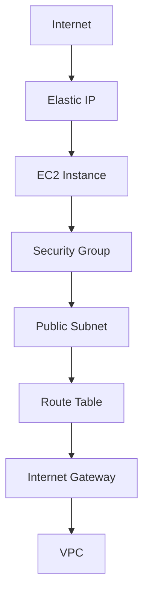

# Terraform-AWS Project

This repository contains AWS infrastructure project built using Terraform to get you 
started in IaC.

## Project Overview

The infrastructure provisions:

- A custom VPC
- A public subnet
- Internet Gateway and routing
- Security Group with SSH and HTTP access
- EC2 instance
- Elastic IP associated with the instance

This project focuses on:
- Terraform workflow (`init`, `plan`, `apply`, `destroy`)
- Providers
- Resources
- Variables and outputs
- State management (local)

---

## Prerequisites

- Terraform >= 1.3
- AWS Account
- AWS CLI configured (`aws configure`)
- An existing EC2 key pair in AWS

---

## Project Structure
```
├── providers.tf # AWS provider configuration
├── versions.tf # Terraform version constraints
├── variables.tf # Input variables
├── terraform.tfvars.example
├── vpc.tf # Networking resources
├── security.tf # Security group
├── ec2.tf # EC2 and Elastic IP
├── outputs.tf # Output values
└── README.md
```
## Infrastructure architecture diagram
```
This Terraform project provisions a VPC with a public subnet, internet routing, and security rules so an EC2 instance with an Elastic IP can be securely accessed from the public internet.
```


---

## Usage

### 1. Clone the repository

```bash
git clone https://github.com/lukesh-b/terraform-IaC.publ.git
cd terraform-aws-prj
```

### 2. Create variable file

```bash
cp terraform.tfvars.example terraform.tfvars
```

### 3. Initialize Terraform

```bash
terraform init
```

### 4. Review the plan

```bash
terraform plan
```

### 5. Apply the configuration

```bash
terraform apply
```

### 6. Destroy Resources (ENSURE YOU DESTROY ANY CREATED RESOURCES !!!)

```bash
terraform destroy -auto-approve
```
